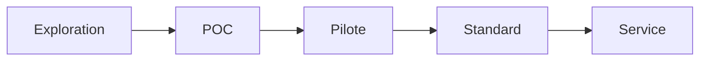

# Innovation Status

## Statut actuel du projet
- [ ] Exploration
- [x] POC
- [ ] Pilote
- [ ] Standard interne
- [ ] Service production

## Suivi
- **Date de création** : 2026-02-22
- **Responsable** : Équipe Talent Tech / Engineering Enablement
- **Prochaine étape attendue** : Pilote sur 1 équipe recrutement pendant 1 mois

## Critères de passage POC -> Pilote
- 50+ candidats évalués sur une période continue.
- Collecte complète des KPIs définis dans `VALUE.md`.
- Satisfaction recruteurs >= 4/5.
- 0 incident bloquant sur 4 semaines.

## Risques identifiés
- Vieillissement de la banque de questions.
- Corrélation partielle score QCM vs performance réelle.
- Baisse du taux de complétion en cas de friction UX.

## Pipeline de maturité

