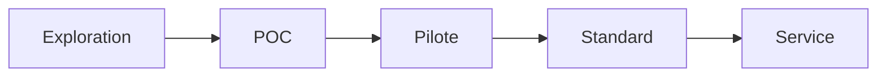

# Innovation Status

## Statut actuel du projet
- [ ] Exploration
- [x] POC
- [ ] Pilote
- [ ] Standard interne
- [ ] Service production

## Métadonnées de suivi
- **Date de création** : 2026-02-22
- **Responsable** : Équipe Talent Tech / Engineering Enablement
- **Prochaine étape attendue** : Pilote avec un vrai flux de recrutement (1 équipe, 1 mois)

## Critères de passage au niveau supérieur (POC -> Pilote)
- Au moins 50 candidats évalués.
- Collecte de KPI complète (complétion, scores, conversion entretien).
- Feedback recruteurs >= 4/5 sur l’utilité opérationnelle.
- Aucune anomalie bloquante de session pendant 4 semaines.

## Risques identifiés
- Obsolescence des questions techniques.
- Corrélation insuffisante entre score QCM et performance réelle.
- Friction UX candidate pouvant réduire le taux de complétion.

## Pipeline de maturité

