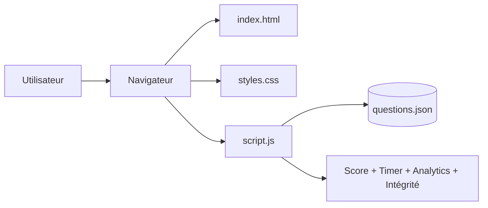

# Architecture

## Vue simplifiée

## Flux principal
1. Le navigateur charge les artefacts statiques du repository.
2. `script.js` lit `questions.json`.
3. Le moteur de test distribue les questions et évalue chaque réponse.
4. L'UI est mise à jour en temps réel (score, temps, historique).

## Décisions d'architecture (POC)
- **Statique-first** : zéro dépendance backend pour accélérer l'adoption.
- **Données locales** : versionnage simple de la banque de questions.
- **Exécution locale** : démarrage immédiat via `make run`.
