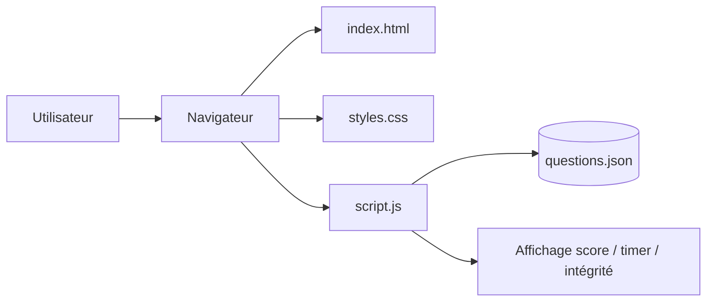

# Architecture

## Vue simplifiée

## Responsabilités
- **UI statique** : rendu des écrans et contrôles.
- **Moteur d’évaluation (script.js)** : orchestration du test, randomisation, scoring, analytics.
- **Source de données locale** : banque de questions JSON versionnée dans le repo.
